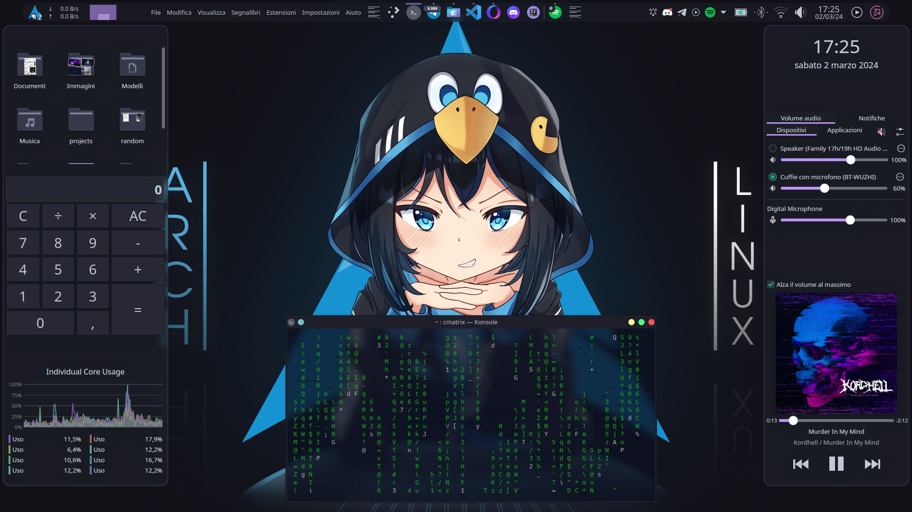
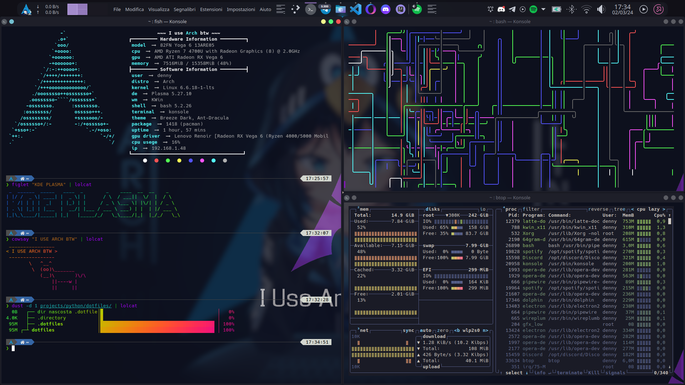
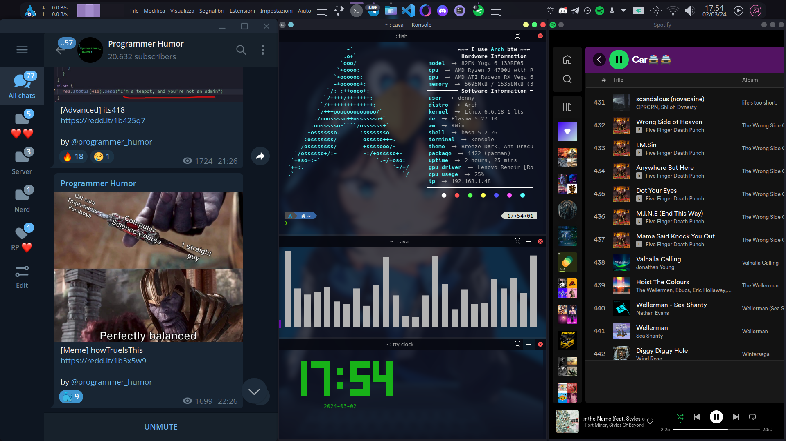

<h1 align="center">MY KDE SETUP</h1>

|                Desktop                |                 Dock                 |
| :------------------------------------: | :-----------------------------------: |
|    |      |
|              Filemanager              |                Konsole                |
|    |  |
|               Searchbar               |                Browser                |
|  |    |
|             Random Things             |          Visual Studio Code          |
|    |      |
